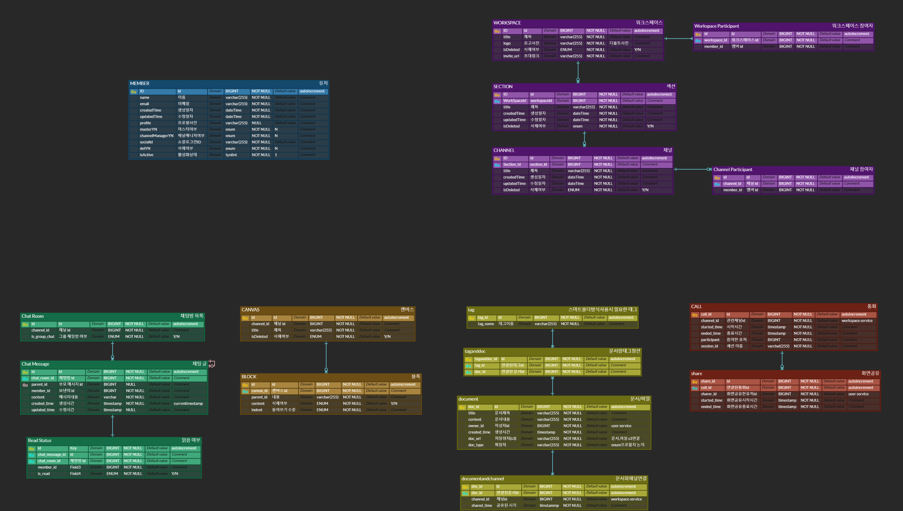

# 📁 Synchrome

> 실시간 커뮤니케이션 및 협업을 위한 올인원 플랫폼

## 📌 팀원소개

<table>
  <tr>
    <td align="center" width="150">
      
      

      <b>정준환</b> 팀장
    </td>
    <td align="center" width="150">
      
      

      <b>이준서</b> 팀원
    </td>
    <td align="center" width="150">
      
      

      <b>임성재</b> 팀원
    </td>
    <td align="center" width="150">
      
      

      <b>홍성혁</b> 팀원
    </td>
  </tr>
</table>

---

## 📌 목차

1. [프로젝트 개요](#프로젝트-개요)
2. [문서 목록](#문서-목록)
3. [프로젝트 기획서 (프로젝트기획)](#프로젝트-기획서-프로젝트기획)
4. [요구사항 정의서 (프로젝트기획)](#요구사항-정의서-프로젝트기획)
5. [시스템 아키텍처 설계서 (프로젝트기획)](#시스템-아키텍처-설계서-프로젝트기획)
6. [WBS (프로젝트기획)](#wbs-프로젝트기획)
7. [ERD (프로젝트기획)](#erd-프로젝트기획)
8. [화면설계서 (프로젝트기획)](#화면설계서-프로젝트기획)
9. [프로그램사양서 (백엔드 설계 및 구축)](#프로그램사양서-백엔드-설계-및-구축)
10. [단위 테스트 결과서 (백엔드 설계 및 구축)](#단위-테스트-결과서-백엔드-설계-및-구축)
11. [UI/UX 단위 테스트 결과서 (프론트엔드 설계 및 구축)](#uiux-단위-테스트-결과서-프론트엔드-설계-및-구축)
12. [배포 후 통합 테스트 결과서 (시스템 통합)](#배포-후-통합-테스트-결과서-시스템-통합)
13. [CI/CD 계획서 (시스템 통합)](#cicd-계획서-시스템-통합)
14. [배포 및 운영](#배포-및-운영)
15. [팀원 정보](#팀원-정보)

---

## 📖 프로젝트 개요

- **주요 기능 요약** :  
  - **1️⃣ 실시간 커뮤니케이션 및 협업**  
    - 실시간 채팅 및 메시지 동기화  
    - 음성 및 화상 통화 지원  
    - 메시지 및 알림 시스템 제공  
  - **2️⃣ 파일 및 문서 관리**  
    - 드래그 앤 드롭 방식의 파일 공유  
    - 클라우드 기반 파일 저장 및 버전 관리  
    - 문서(캔버스) 실시간 공동 편집 기능  
  - **3️⃣ 스마트 검색 및 확장성**  
    - Elasticsearch 기반의 메시지 및 파일 검색 기능 제공  
    - 마이크로서비스 아키텍처(MSA) 기반으로 확장성 확보  
    - 모든 데이터 자동 동기화(Sync)로 최신 정보 유지 

---

## 📄 문서 목록

| 문서명 | 분류 | 설명 | 다운로드 |
|:----------------------------------|:--------------------------|:------------------------------------------|:---------------------------------------------|
| 프로젝트 기획서 (프로젝트기획) | 프로젝트기획 | 프로젝트 배경, 목적, 추진 전략 등 | [📎 프로젝트 기획서](./docs/프로젝트_기획서.pdf) |
| 요구사항 정의서 (프로젝트기획) | 프로젝트기획 | 기능 및 비기능 요구사항 정의 | [📎 요구사항 정의서](https://docs.google.com/spreadsheets/d/1nOe75VhnAemKxZIbsGkTzGwdzArp8Akl8MRr9XVAgQU/edit?gid=1069002790#gid=1069002790) |
| 시스템 아키텍처 설계서 (프로젝트기획) | 프로젝트기획 | 시스템 구성 및 흐름도 | [📎 시스템 아키텍처 설계서](./docs/시스템_아키텍처_설계서.pdf) |
| WBS (프로젝트기획) | 프로젝트기획 | 업무 분장 및 세부 일정 | [📎 WBS](https://docs.google.com/spreadsheets/d/1nOe75VhnAemKxZIbsGkTzGwdzArp8Akl8MRr9XVAgQU/edit?gid=1938375019#gid=1938375019) |
| ERD (프로젝트기획) | 프로젝트기획 | 데이터베이스 구조 및 관계 | [📎 ERD](https://www.erdcloud.com/d/4bmoj8iAdXqZrvMs5) |
| 화면설계서 (프로젝트기획) | 프로젝트기획 | UI/UX 화면 흐름 및 구조 | [📎 화면설계서](https://www.figma.com/design/uPfg5bZWj3IgpGT3QXOHVM/Synchrome?node-id=17-2&p=f&t=5fHFmbCF45cLCuo1-0) |
| 프로그램사양서 (백엔드 설계 및 구축) | 백엔드 설계 및 구축 | 각 기능별 상세 사양 기술 | [📎 프로그램사양서](https://docs.google.com/spreadsheets/d/1nOe75VhnAemKxZIbsGkTzGwdzArp8Akl8MRr9XVAgQU/edit?gid=282459126#gid=282459126) |
| 단위 테스트 결과서 (백엔드 설계 및 구축) | 백엔드 설계 및 구축 | 기능별 테스트 수행 결과 | [📎 단위 테스트 결과서](https://documenter.getpostman.com/view/41079375/2sB2cYbzyZ) |
| UI/UX 단위 테스트 결과서 (프론트엔드 설계 및 구축) | 프론트엔드 설계 및 구축 | 화면 기반 사용자 테스트 결과 | [📎 UI/UX 단위 테스트 결과서](./docs/UIUX_단위_테스트_결과서.pdf) |
| 배포 후 통합 테스트 결과서 (시스템 통합) | 시스템 통합 | 배포 후 통합 테스트 결과 정리 | [📎 배포 후 통합 테스트 결과서](./docs/배포후_통합_테스트_결과서.pdf) |
| CI/CD 계획서 (시스템 통합) | 시스템 통합 | 배포 및 자동화 파이프라인 계획 | [📎 CI/CD 계획서](./docs/CICD_계획서.pdf) |

---

## 📑 프로젝트 기획서 (프로젝트기획)

## 📌 1. 프로젝트 추진 배경
- 기존 협업 환경은 **채팅, 파일 공유, 회의, 문서 관리 등** 다양한 툴이 분산되어 있어  
  업무 효율 저하 및 정보 동기화 문제 발생
- **원격 근무/비대면 협업 증가**로 인해, **실시간 소통과 데이터 공유의 중요성** 증대
- 하나의 플랫폼에서 모든 협업을 통합하려는 수요 급증  
  → **올인원 협업 솔루션 필요**

## 🎯 2. 프로젝트 목적
- 다양한 협업 기능(채팅, 파일 공유, 음성/화상 통화 등)을 **하나의 플랫폼에 통합**하여  
  업무 생산성을 극대화하고 **실시간 동기화 기반의 협업 환경 제공**
- **별도 도구 전환 없이 즉시 피드백, 실시간 소통, 파일 공유**를 가능하게 하여  
  팀워크와 업무 흐름을 강화

## 🚀 3. 추진 전략 (핵심 목표)

| 전략 항목                          | 내용                                                      |
|-----------------------------------|-----------------------------------------------------------|
| ✅ 실시간 동기화(Sync) 지원       | 모든 데이터 자동 동기화로, **최신 정보 즉시 공유 가능**    |
| ✅ 실시간 채팅 및 피드백 제공     | **신속한 커뮤니케이션**으로 업무 지연 최소화               |
| ✅ 파일 공유 및 클라우드 저장     | **드래그 앤 드롭 방식**, 효율적 파일 관리 및 협업           |
| ✅ 음성/화상 통화 지원            | **원격 회의 및 협업 강화** (WebRTC 기반)                  |
| ✅ 외부 서비스 연동               | 알림, 캘린더 등 **업무 필수 기능 통합**                    |
| ✅ 고속 검색 지원                 | **Elasticsearch 기반** → 메시지/파일 빠른 검색 가능        |
| ✅ MSA 기반 유연한 아키텍처 구축  | **확장성 및 기능 추가 용이**                               |

---

## 📑 요구사항 정의서 (프로젝트기획)
- 기능적 / 비기능 요구사항, 유즈케이스
👉 [📎 문서 보기](https://docs.google.com/spreadsheets/d/1nOe75VhnAemKxZIbsGkTzGwdzArp8Akl8MRr9XVAgQU/edit?gid=1069002790#gid=1069002790)

---

## 📑 시스템 아키텍처 설계서 (프로젝트기획)
> 시스템 구성도 이미지 삽입  
)  

---

## 📑 WBS (프로젝트기획)
- 업무 분류 체계, 일정계획
👉 [📎 문서 보기](https://docs.google.com/spreadsheets/d/1nOe75VhnAemKxZIbsGkTzGwdzArp8Akl8MRr9XVAgQU/edit?gid=1938375019#gid=1938375019)

---

## 📑 ERD (프로젝트기획)
> 데이터베이스 구조  

  

---

## 📑 화면설계서 (프로젝트기획)
> 주요 UI/UX 흐름  
👉 [📎 문서 보기](https://www.figma.com/design/uPfg5bZWj3IgpGT3QXOHVM/Synchrome?node-id=17-2&p=f&t=rBab0xfYe9HFknH1-0)

---

## 📑 프로그램사양서 (백엔드 설계 및 구축)
- 상세 기능별 사양, 입력/출력 정의
👉 [📎 문서 보기](https://docs.google.com/spreadsheets/d/1nOe75VhnAemKxZIbsGkTzGwdzArp8Akl8MRr9XVAgQU/edit?gid=282459126#gid=282459126)

---

## 📑 단위 테스트 결과서 (백엔드 설계 및 구축)
👉 [📎 문서 보기](https://documenter.getpostman.com/view/41079375/2sB2cYbzyZ)

---

## 📑 UI/UX 단위 테스트 결과서 (프론트엔드 설계 및 구축)
- 사용성 테스트, 인터페이스 반응
👉 [📎 문서 보기](./docs/UIUX_단위_테스트_결과서.pdf)
---

### 📁 워크스페이스

  
로그인 및 워크스페이스 생성

  

  
워크스페이스 편집

  

  
사용자 초대

  

  
섹션 및 채널 생성

  

  
워크스페이스별 독립 채널 관리

  

### 💬 채팅

  
채팅 기능

  

  
검색 - 채팅 메시지 검색

  

  
멘션 알림

  

### 🎥 화상회의

  
입장 및 알림

  

  
카메라 및 마이크 설정

  

  
화면 녹화

  

  
화면 공유

  

### 📅 캘린더

  
일정 생성 및 카테고리 추가

  

  
연속 일정 생성 (n일)

  

  
반복 일정 생성

  

  
상세 일정 조회 및 삭제

  

  
워크스페이스 + 카테고리 이중 필터

  

### 🧩 캔버스

  
캔버스 생성 및 작성

  

  
실시간 동시 편집 (멀티유저)

  

### 💳 결제

  
구독 및 구독 취소 기능

  

---

## 📑 배포 후 통합 테스트 결과서 (시스템 통합)
- 통합 테스트 항목 및 결과 요약
👉 [📎 문서 보기](./docs/배포후_통합_테스트_결과서.pdf)

---

## 📑 CI/CD 계획서 (시스템 통합)
| 항목 | 내용 |
|:------------------|:-------------------------------|
| 자동화 도구 | GitHub Actions, Docker |
| 배포 환경 | AWS EC2 / ECS |
| 테스트 방식 | 단위/통합 자동 테스트 포함 |

👉 [📎 문서 보기](./docs/CICD_계획서.pdf)

---

## 🚀 배포 및 운영

- 운영 URL : [https://yourproject.com](https://yourproject.com)  
- 배포 환경 : AWS / Vercel / 기타  
- 컨테이너 이미지 : `yourproject:latest`
